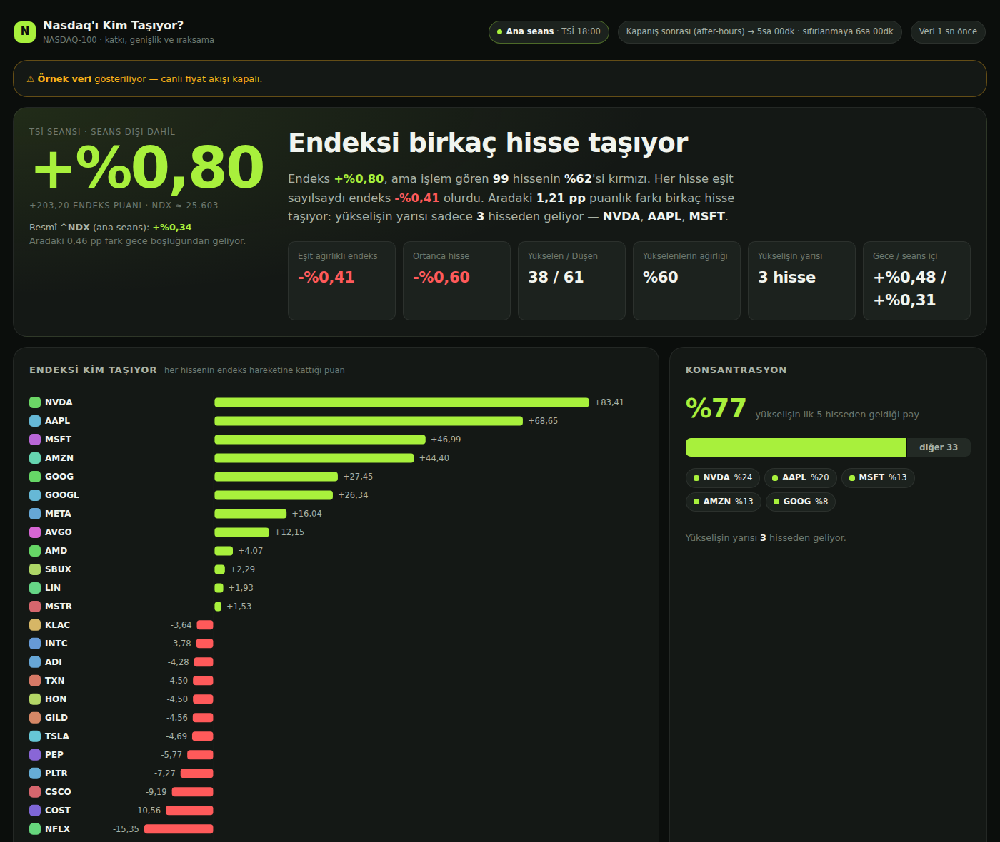

# Nasdaq'ı Kim Taşıyor?

Nasdaq yeşil görünürken takip ettiğiniz hisselerin çoğu kırmızıysa, bu bir
yanılsama değil. NASDAQ-100 **piyasa değeri ağırlıklı** bir endeks ve
konsantrasyon uçta (10 Ağustos 2026 verisiyle):

| | |
|---|---|
| NVDA tek başına | **%12,97** — en küçük **69** hissenin toplamından fazla |
| İlk 5 hisse | %45,2 |
| İlk 10 hisse | **%66,0** — endeksin üçte ikisi |
| En küçük 50 hisse | %7,0 |

Yani birkaç mega-cap yükselirken 60+ hisse düşebilir ve endeks yine de yeşil
kapanır.

Bu site o dağılımı tek bakışta okunur hale getiriyor. Merkezdeki soru:
**endeksin bugünkü hareketini kim üretti?**



---

## Ne gösteriyor

| Bölüm | Cevapladığı soru |
|---|---|
| **Teşhis** | Endeks ne yaptı, kaç hisse kırmızı, eşit ağırlıklı olsaydı ne olurdu |
| **Endeksi kim taşıyor** | Her hissenin endeks hareketine kattığı puan (ıraksayan çubuklar) |
| **Konsantrasyon** | Yükselişin ne kadarı ilk 5 hisseden geliyor |
| **Sayı mı, ağırlık mı?** | Aynı piyasa iki ölçüyle: hisse sayısı vs endeks ağırlığı |
| **Gün içi ıraksama** | Ağırlıklı endeks ile eşit ağırlıklı endeksin gün boyunca ayrışması |
| **Ağırlık haritası** | Kutu alanı = ağırlık, renk = getiri (treemap) |
| **Taşıyıcıları çıkarırsak** | İlk N taşıyıcı olmasaydı endeks ne olurdu |
| **Tüm hisseler** | 100 hissenin tamamı, sıralanabilir tablo |
| **Son 30 seansın taşıyıcıları** | Uzun vadede endeksi en çok kim taşıyor |

---

## Hesaplama

**Seans.** TSİ 00:00–24:00, **seans dışı (pre/after-market) işlemler dahil.**
Türkiye sabit UTC+3 olduğu için TSİ gece yarısı her zaman **21:00 UTC**'dir.
Bu sınır ABD'de yazın 17:00 ET'ye, kışın 16:00 ET'ye denk gelir — yani kışın
TSİ günü tam olarak kapanış-kapanış olurken, yazın pencere bir saat
after-hours'a kayar.

**Baz fiyat.** TSİ gece yarısından *kesinlikle önceki* son işlem baskısı
(seans dışı baskılar dahil).

**Katkı.** NDX gün içi sabit bölenli modifiye kap-ağırlıklı bir endeks:

```
NDX_t / NDX_baz = 1 + Σ wᵢ·rᵢ
```

Bir hissenin katkısı `wᵢ·rᵢ`; bütün katkılar toplandığında endeks hareketini
**birebir** verir. `^NDX` seans dışında tik atmadığı için TSİ seansının endeks
hareketi bu özdeşlikten sentezlenir — tahmin değil, endeksin kendi tanımı.

Ağırlıklar **baz fiyattan** türetilir (`wᵢ = payAdediᵢ·bazᵢ / Σ`), önceki
kapanıştan değil; aksi halde yazın özdeşlik sessizce bozulur.

**Resmî rakamla fark.** TV'deki NDX yüzdesi yalnızca ana seansı kapsar;
buradaki gece boşluğunu da içerir. İkisi de hero panelinde yan yana durur.

---

## Çalıştırma

Node 22+, **npm bağımlılığı yok.**

```bash
# Örnek veriyle (bu ortamda tek yol — aşağıya bakın)
npm run fixture            # örnek veri üret
npm run seed-history       # geçmiş bileşenleri için sahte geçmiş
FIXTURE_MODE=1 npm start   # http://localhost:3000

npm test                   # 50 test — matematik, seans, ayrıştırma, healthcheck
npm run import-holdings    # data/ndx-components.tsv -> holdings.seed.json
npm run doctor             # canlı veri yolunun her adımını dener ve raporlar
npm run shoot              # her durumun ekran görüntüsü (Playwright)
```

### Bu geliştirme ortamında canlı veri çalışmaz

Container'ın kurumsal çıkış politikası **tüm piyasa verisi host'larını 403 ile
engelliyor** (Yahoo, Invesco, Stooq, Finnhub, TwelveData). `npm run doctor`
bunu saniyeler içinde gösterir. Canlı yol yalnızca Railway'de çalışır; bu
yüzden fixture modu kalıcı bir özellik, geçici bir çözüm değil.

---

## Railway'e kurulum

1. Repoyu Railway'e bağlayın. Nixpacks Node'u otomatik algılar; Dockerfile
   gerekmiyor. `PORT` Railway tarafından enjekte edilir.
2. ⚠️ **Servisi ABD bölgesine alın.** AB çıkış IP'si Yahoo'nun
   `guce.yahoo.com` onay yönlendirmesini tetikler ve crumb el sıkışmasını
   bozar. Kod bunu algılayıp gürültülü log basar ve yedek yola düşer.
3. Bir **volume** bağlayın (örn. `/data`). Railway
   `RAILWAY_VOLUME_MOUNT_PATH`'i otomatik verir. Volume olmadan da site
   çalışır; sadece geçmiş ve gün içi seri birikmez.
4. Ortam değişkeni gerekmez — API anahtarı yok. `.env.example`'daki ayarlar
   isteğe bağlı.
5. Healthcheck: `/api/health`. Süreç dinlemeye başlar başlamaz 200 döner —
   veri boru hattının ilk turunu (101 chart isteği) beklemez. Site açılışta
   önce yalnızca kotasyonlarla (~2 sn) dolar, gerçek baz fiyatlar arka planda
   birkaç dakika içinde yerine geçer.

### İlk dağıtımdan sonra kontrol

```bash
curl https://<uygulamanız>/api/health
curl https://<uygulamanız>/api/snapshot | jq '.quality, .index.changePct, .index.trackingErrorPp'
```

- `/api/health` **her zaman 200** döner (süreç ayakta olduğu sürece). Veri
  hazırlığı gövdedeki `ready` alanında; birkaç saniye içinde `true` olmalı.
- `quality.source == "yahoo"` → hızlı yol (v7 toplu kotasyon) çalışıyor.
  `"yahoo-chart"` → crumb ucu kısıtlamış, crumb'sız chart yoluna düşülmüş;
  veri yine canlı, sadece daha maliyetli.
- `quality.weightsSource == "invesco"` → gerçek ağırlıklar okundu.
  `"bundled-approx"` görüyorsanız Invesco'ya erişilememiş; site çalışır ama
  ağırlıklar yaklaşıktır ve UI bunu söyler.
- Ana seansta `trackingErrorPp` küçük (|Δ| < 0,15) olmalı. Büyükse ağırlıklar
  eskimiş demektir.

---

## Mimari

Tek uzun ömürlü Node süreci. Sıfır bağımlılık, sıfır derleme adımı.

**Veri merdiveni** (ucuzdan pahalıya, tam kapsamdan kısmiye):

| Sıra | Kaynak | İstek/döngü | Kapsam |
|---|---|---|---|
| 1 | Yahoo `v8/spark` (toplu, anahtarsız) | 1 | 101 hisse |
| 2 | Yahoo `v8/chart` (sembol başına) | ≤102 | 101 hisse |
| 3 | Yahoo `v7/quote` (crumb) | 3 | kapalı — `YAHOO_USE_CRUMB=1` |
| 4 | **Hyperliquid / Binance perp** | ~2 | **kısmi** — yalnızca listelenen hisseler |

429 görülünce üstel devre kesici devreye girer (5→120 dk) ve o süre Yahoo'ya
hiç dokunulmaz. 4. basamak *kısmi kapsam* modudur: hüküm PARTIAL'a sabitlenir,
genişlik/eşit-ağırlık istatistikleri gizlenir, kısmi günler geçmişe yazılmaz
ve arayüz fiyatların perp olduğunu açıkça söyler. Hangi borsanın kullanılacağını
`/api/discover` ölçer (kesişim + 24s hacim) — tahmin edilmez.

```
shared/     matematik + seans mantığı — SUNUCU VE TARAYICI ORTAK, tek kaynak
server/     http, poller, depolama, veri kaynakları
public/     vanilya ES modülleri, el yazımı SVG grafikler
data/       ağırlık seed'i + örnek veri
scripts/    fixture, sahte geçmiş, doctor, ekran görüntüsü
test/       50 test
```

`shared/` hem Node hem tarayıcı tarafından import edilir (`/shared/` altına
mount edilir) — kopya yok, derleme yok.

**Dayanıklılık.** Bozuk anlık görüntü asla yayınlanmaz: kurulur, değişmezleri
doğrulanır (`Σw = 1`, `Σ katkı = endeks hareketi`), sonra atomik takas edilir.
Bir kaynak düşerse site bozulmaz, körelir — ve neyin köreldiğini üstteki
uyarı bandında **söyler**.

---

## Renk seçimi

Yükseliş/düşüş renkleri göz kararıyla değil, renk körlüğü simülasyonuyla
ölçülerek seçildi:

| Çift | Deuteranopi ΔE | Sonuç |
|---|---|---|
| Klasik finans yeşili/kırmızısı `#39D353` / `#FF5C5C` | **6,0** | çöküyor — renk körü için fiilen aynı renk |
| Lime'a kaydırılmış `#A8F03C` / `#FF5A5A` | **18,7** | ✓ |

İstenen neon-lime estetiği aynı zamanda erişilebilir olan seçim çıktı. Ayrıca
renk hiçbir yerde tek sinyal değil: konum (taşıyanlar sağda, çekenler solda),
açık `+/−` işaretleri ve her grafiğin tablo ikizi eşlik ediyor.

---

## Bilinen sınırlar

- **Yahoo resmî olmayan bir API ve paylaşımlı IP'lerde kısıtlıyor.** Railway'in
  çıkış IP'si çok kullanıldığı için `v1/test/getcrumb` ucu `429` dönebiliyor.
  Bu durumda sistem **crumb'sız `v8/chart` yoluna** düşüyor: tek çağrıdan hem
  baz hem güncel fiyat çıkıyor, `quality.source` `"yahoo-chart"` oluyor ve
  crumb ucu 30 dakika elleniyor. Maliyeti yüksek (sembol başına bir istek)
  ama site karanlıkta kalmıyor. Kalıcı çözüm anahtarlı bir sağlayıcı olurdu.
- **`data/holdings.seed.json` kullanıcı tarafından sağlanan bir anlık
  görüntüden üretildi** (`data/ndx-components.tsv`, 10 Ağustos 2026). Ağırlık
  toplamı %100,01 çıkıyor. Invesco'ya erişilebildiğinde tamamen değiştirilir.
  Üyelik ve ağırlıklar zamanla eskir; `npm run import-holdings` ile tazelenir.
- **Kaynak listedeki bir satır bozuktu ve seed'e alınmadı:** BKNG ile CRWD
  birebir aynı fiyat/değişim/yüzde taşıyordu (kopyalanmış satır). Yanlış fiyat
  örtülü pay adedini bozup BKNG'yi %0,38 yerine ~%8 gösterirdi.
  `scripts/import-holdings.js` bu tür iç tutarsızlıkları yakalayıp reddediyor.
- **Tatil takvimi 2028 sonunda tükeniyor** (`shared/holidays.js`), elle
  güncellenmeli.
- **Canlı veri yolu bu ortamda test edilemedi.** Ayrıştırma ve seçim mantığı
  (`pickCurrent`, CSV ayrıştırıcı) kayıtlı örnek yüklerle test edildi; ağ
  katmanı yalnızca Railway'de doğrulanabilir.

Yatırım tavsiyesi değildir.
